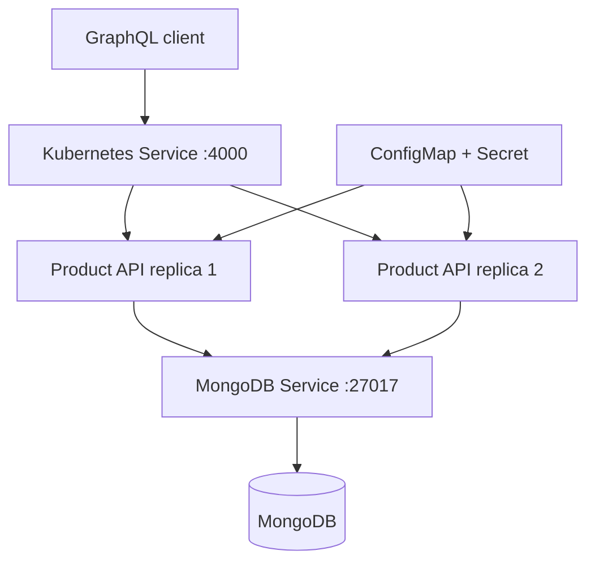

# CafeFlow – Cloud-Native Product Catalog Service

CafeFlow is a production-structured GraphQL product catalog built with Node.js,
Express, Apollo Server, MongoDB and Mongoose. It provides product and inventory
management through GraphQL, containerized local execution with Docker Compose,
and a Kubernetes deployment with configuration management and health probes.

## Architecture



## Technology stack

- Node.js 20+ and Express 5
- Apollo Server and GraphQL
- MongoDB and Mongoose
- Vitest and V8 coverage
- Docker and Docker Compose
- Kubernetes

## Implemented capabilities

- Create, read, update and delete products
- Unique, normalized product SKU
- Pagination with page metadata
- Sorting by creation date, update date, name, price or stock quantity
- Search by product name or SKU
- Filtering by category and active status
- Low-stock filtering and computed inventory status
- Consistent `BAD_USER_INPUT`, `NOT_FOUND` and `CONFLICT` GraphQL errors
- REST liveness and dependency-aware readiness endpoints
- Structured logs and graceful shutdown
- Non-root Docker runtime
- Kubernetes Deployments, Services, ConfigMap, Secret, health probes and
  resource limits

## Project structure

```text
cafeflow-product-service/
├── src/
│   ├── config/
│   ├── graphql/
│   ├── models/
│   ├── services/
│   ├── utils/
│   ├── app.js
│   └── server.js
├── tests/
├── kubernetes/
│   ├── namespace.yaml
│   ├── configmap.yaml
│   ├── secret.example.yaml
│   ├── mongodb-deployment.yaml
│   ├── mongodb-service.yaml
│   ├── product-deployment.yaml
│   └── product-service.yaml
├── postman/
├── .env.example
├── Dockerfile
├── docker-compose.yml
├── package.json
├── vitest.config.js
├── VERIFICATION.md
└── README.md
```

## Quick start with Docker

Make sure Docker Desktop is running, then execute:

```bash
docker compose up --build
```

Available endpoints:

- GraphQL API: <http://localhost:4000/graphql>
- Liveness: <http://localhost:4000/health/live>
- Readiness: <http://localhost:4000/health/ready>

Check container status:

```bash
docker compose ps
```

Both `cafeflow-mongodb` and `cafeflow-product-service` should report
`healthy`.

Stop the containers while preserving MongoDB data:

```bash
docker compose down
```

Remove the containers and MongoDB volume:

```bash
docker compose down -v
```

> `docker compose down -v` permanently deletes the local database volume.

## Local start without Docker

Start MongoDB on port `27017`.

Linux or macOS:

```bash
cp .env.example .env
npm ci
npm start
```

Windows PowerShell:

```powershell
Copy-Item .env.example .env
npm ci
npm start
```

## API testing

Postman is optional. A collection is available at:

```text
postman/CafeFlow-GraphQL.postman_collection.json
```

The GraphQL API can be tested directly from PowerShell:

```powershell
$body = @{
    query = "query { __typename }"
} | ConvertTo-Json

Invoke-RestMethod `
    -Uri "http://localhost:4000/graphql" `
    -Method Post `
    -ContentType "application/json" `
    -Body $body |
    ConvertTo-Json -Depth 10
```

Expected response:

```json
{
  "data": {
    "__typename": "Query"
  }
}
```

The Apollo browser landing page can require internet access to load its full
interface. This does not affect the GraphQL HTTP API.

## Example GraphQL operations

### Create a product

```graphql
mutation {
  createProduct(
    input: {
      sku: "COF-101"
      name: "Cappuccino"
      description: "Espresso with steamed milk"
      price: 180
      stockQuantity: 20
      categoryId: "coffee"
    }
  ) {
    id
    sku
    name
    stockQuantity
    inventoryStatus
  }
}
```

### List and filter products

```graphql
query {
  products(
    page: 1
    limit: 10
    search: "coffee"
    categoryId: "coffee"
    active: true
    sortBy: PRICE
    sortDirection: ASC
  ) {
    items {
      id
      sku
      name
      price
      stockQuantity
      inventoryStatus
    }
    pageInfo {
      page
      limit
      totalItems
      totalPages
      hasNextPage
      hasPreviousPage
    }
  }
}
```

### Update stock

```graphql
mutation {
  updateProductStock(
    id: "REPLACE_WITH_PRODUCT_ID"
    stockQuantity: 4
  ) {
    id
    stockQuantity
    inventoryStatus
    updatedAt
  }
}
```

## Automated tests

Install dependencies and run the test suite:

```bash
npm ci
npm test
npm run test:coverage
```

The test suite contains 39 tests covering validation, duplicate SKU handling,
lookup, updates, deletion, pagination, error mapping and query-filter
construction.

Verified coverage across the tested service and validation modules:

| Metric | Coverage |
| --- | ---: |
| Statements | 96.37% |
| Branches | 90.07% |
| Functions | 100% |
| Lines | 96.35% |

Coverage thresholds are enforced by `vitest.config.js`.

## Kubernetes deployment

The supplied MongoDB deployment uses `emptyDir` and is intended for local
learning. Use a persistent volume or a managed MongoDB service for persistent
environments.

### 1. Build the application image

```bash
docker build -t cafeflow-product-service:1.0.0 .
```

Docker Desktop Kubernetes normally has direct access to locally built images.
For Minikube:

```bash
minikube image load cafeflow-product-service:1.0.0
```

### 2. Create the local Secret manifest

The real `kubernetes/secret.yaml` file is intentionally ignored by Git. Create
it from the safe example before deployment.

Windows PowerShell:

```powershell
Copy-Item kubernetes\secret.example.yaml kubernetes\secret.yaml
```

Linux or macOS:

```bash
cp kubernetes/secret.example.yaml kubernetes/secret.yaml
```

Never commit real credentials or production connection strings.

### 3. Deploy the resources

```bash
kubectl apply -f kubernetes/namespace.yaml
kubectl apply -f kubernetes/configmap.yaml
kubectl apply -f kubernetes/secret.yaml
kubectl apply -f kubernetes/mongodb-service.yaml
kubectl apply -f kubernetes/mongodb-deployment.yaml
kubectl apply -f kubernetes/product-service.yaml
kubectl apply -f kubernetes/product-deployment.yaml
```

### 4. Verify the rollout

```bash
kubectl rollout status deployment/mongodb -n cafeflow --timeout=120s
kubectl rollout status deployment/cafeflow-product-service -n cafeflow --timeout=180s
kubectl get deployments,pods,services,configmaps,secrets -n cafeflow
```

Expected deployment state:

- Product service Deployment: `2/2` available replicas
- MongoDB Deployment: `1/1` available replica
- Three pods in `Running` and `Ready` state
- Two ClusterIP Services
- One application ConfigMap and one application Secret

### 5. Access the Kubernetes service

```bash
kubectl port-forward service/cafeflow-product-service 4000:4000 -n cafeflow
```

In another terminal:

```powershell
Invoke-RestMethod http://localhost:4000/health/ready |
    ConvertTo-Json -Depth 5
```

Expected status:

```json
{
  "status": "READY",
  "dependencies": {
    "mongodb": "UP"
  }
}
```

Delete the local learning deployment when it is no longer needed:

```bash
kubectl delete namespace cafeflow
```

> Deleting the namespace also deletes the learning MongoDB pod and its
> `emptyDir` data.

## Configuration

| Variable | Purpose | Default |
| --- | --- | --- |
| `NODE_ENV` | Runtime environment | `development` |
| `PORT` | HTTP port | `4000` |
| `MONGO_URI` | MongoDB connection string | Local CafeFlow database |
| `CORS_ORIGIN` | Allowed client origin | `*` |
| `GRAPHQL_INTROSPECTION` | Enable GraphQL schema introspection | `true` |
| `LOG_LEVEL` | Minimum structured-log level | `info` |
| `LOW_STOCK_THRESHOLD` | Maximum quantity treated as low stock | `5` |

## Verified results

Verified locally on 29 July 2026 using Windows, Docker Desktop and Docker
Desktop Kubernetes:

- Docker Compose started MongoDB and the product service successfully.
- Both Docker containers reached healthy status.
- Kubernetes deployed two product-service replicas and one MongoDB replica.
- All three Kubernetes pods reached `Running` and `Ready` status with zero
  restarts.
- ConfigMap, Secret and two ClusterIP Services were created successfully.
- The readiness endpoint returned `READY` with MongoDB reported as `UP`.
- All 39 automated tests passed.
- Line coverage reached 96.35% across the tested modules.

Detailed verification evidence is recorded in
[VERIFICATION.md](VERIFICATION.md).

## Resume description

**CafeFlow – Cloud-Native Product Catalog Service**  
*Node.js, Express.js, GraphQL, Apollo Server, MongoDB, Mongoose, Docker,
Kubernetes, Vitest*

- Developed a GraphQL product-catalog service supporting CRUD, pagination,
  sorting, search, category filtering and computed inventory-status operations.
- Designed MongoDB schemas with validation and unique SKU enforcement, with
  consistent errors for invalid, conflicting and missing resources.
- Containerized the application and MongoDB using Docker Compose with health
  checks and a non-root application container.
- Deployed the service on Kubernetes with two application replicas, ClusterIP
  Services, ConfigMap, Secret, resource limits, and liveness and readiness
  probes.
- Implemented 39 automated tests, achieving 96.35% line coverage, 90.07%
  branch coverage and 100% function coverage across the tested modules.

## Project boundary

`categoryId` is an external category reference. This repository contains one
complete product service, not a claimed multi-service platform. It can later
be integrated with a category service without changing the current project
description.

## License

This project is available under the [MIT License](LICENSE).
