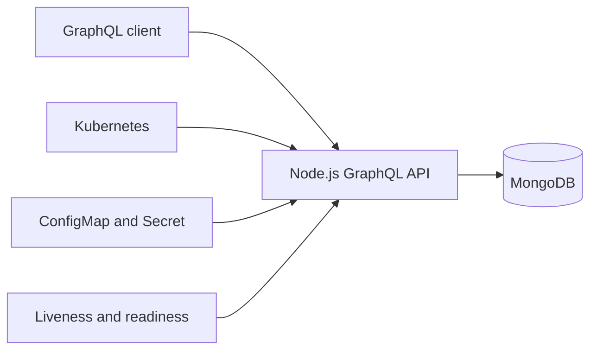

# CafeFlow – Cloud-Native Product Catalog Service

CafeFlow is a production-structured GraphQL product catalog built with Node.js,
Apollo Server, MongoDB and Mongoose. The service supports product management,
inventory tracking, filtering, pagination, containerized local execution and a
Kubernetes deployment with health probes.

## Architecture



## Technology stack

- Node.js 20+ and Express 5
- Apollo Server and GraphQL
- MongoDB and Mongoose
- Vitest
- Docker and Docker Compose
- Kubernetes

## Implemented capabilities

- Create, read, update and delete products
- Unique, normalized product SKU
- Pagination with page metadata
- Sorting by creation date, update date, name, price or stock quantity
- Search by product name or SKU
- Filtering by category and active status
- Low-stock filtering and computed inventory status
- Consistent `BAD_USER_INPUT`, `NOT_FOUND` and `CONFLICT` GraphQL errors
- REST liveness and dependency-aware readiness endpoints
- Structured logs and graceful shutdown
- Non-root Docker runtime
- Kubernetes Deployment, Service, ConfigMap, Secret, probes and resource limits

## Project structure

```text
cafeflow-product-service/
├── src/
│   ├── config/
│   ├── graphql/
│   ├── models/
│   ├── services/
│   ├── utils/
│   ├── app.js
│   └── server.js
├── tests/
├── kubernetes/
├── postman/
├── Dockerfile
├── docker-compose.yml
└── package.json
```

## Quick start with Docker

Docker Desktop must be running.

```bash
docker compose up --build
```

Open:

- GraphQL endpoint: <http://localhost:4000/graphql>
- Liveness: <http://localhost:4000/health/live>
- Readiness: <http://localhost:4000/health/ready>

Stop the containers:

```bash
docker compose down
```

Remove the local MongoDB volume as well:

```bash
docker compose down -v
```

## Local start without Docker

Start a MongoDB instance on port `27017`, then run:

```bash
cp .env.example .env
npm install
npm start
```

On Windows PowerShell:

```powershell
Copy-Item .env.example .env
npm install
npm start
```

## Automated tests

```bash
npm test
npm run test:coverage
```

The included test suite contains **39 passing tests** covering validation,
duplicate SKU handling, lookup, updates, deletion, pagination, error mapping
and query-filter construction. The verified coverage result for the tested
service and validation modules is:

- Statements: **96.37%**
- Branches: **90.07%**
- Functions: **100%**
- Lines: **96.35%**

Coverage thresholds are enforced by `vitest.config.js`.

## Example GraphQL operations

Create a product:

```graphql
mutation {
  createProduct(
    input: {
      sku: "COF-101"
      name: "Cappuccino"
      description: "Espresso with steamed milk"
      price: 180
      stockQuantity: 20
      categoryId: "coffee"
    }
  ) {
    id
    sku
    name
    inventoryStatus
  }
}
```

List and filter products:

```graphql
query {
  products(
    page: 1
    limit: 10
    search: "coffee"
    categoryId: "coffee"
    active: true
    sortBy: PRICE
    sortDirection: ASC
  ) {
    items {
      id
      sku
      name
      price
      stockQuantity
      inventoryStatus
    }
    pageInfo {
      page
      totalItems
      totalPages
      hasNextPage
    }
  }
}
```

Update stock:

```graphql
mutation {
  updateProductStock(
    id: "REPLACE_WITH_PRODUCT_ID"
    stockQuantity: 4
  ) {
    id
    stockQuantity
    inventoryStatus
  }
}
```

## Postman

Import:

```text
postman/CafeFlow-GraphQL.postman_collection.json
```

Run **Create Product**, copy the returned ID into the `productId` collection
variable and then run the remaining requests.

## Kubernetes deployment

The supplied MongoDB deployment uses `emptyDir` and is intended for local
learning. Use a persistent volume or managed MongoDB service in a real
production environment.

Build the application image:

```bash
docker build -t cafeflow-product-service:1.0.0 .
```

For Docker Desktop Kubernetes, the local image is normally available directly.
For Minikube:

```bash
minikube image load cafeflow-product-service:1.0.0
```

Deploy in this order:

```bash
kubectl apply -f kubernetes/namespace.yaml
kubectl apply -f kubernetes/configmap.yaml
kubectl apply -f kubernetes/secret.yaml
kubectl apply -f kubernetes/mongodb-deployment.yaml
kubectl apply -f kubernetes/mongodb-service.yaml
kubectl apply -f kubernetes/product-deployment.yaml
kubectl apply -f kubernetes/product-service.yaml
```

Verify:

```bash
kubectl get all -n cafeflow
kubectl get configmap,secret -n cafeflow
kubectl rollout status deployment/mongodb -n cafeflow
kubectl rollout status deployment/cafeflow-product-service -n cafeflow
kubectl logs deployment/cafeflow-product-service -n cafeflow
```

Access the GraphQL API:

```bash
kubectl port-forward service/cafeflow-product-service 4000:4000 -n cafeflow
```

Then open <http://localhost:4000/graphql>.

Delete the learning deployment:

```bash
kubectl delete namespace cafeflow
```

## Configuration

| Variable | Purpose | Default |
| --- | --- | --- |
| `NODE_ENV` | Runtime environment | `development` |
| `PORT` | HTTP port | `4000` |
| `MONGO_URI` | MongoDB connection string | Local CafeFlow database |
| `CORS_ORIGIN` | Allowed client origin | `*` |
| `GRAPHQL_INTROSPECTION` | Enable GraphQL schema introspection | `true` |
| `LOG_LEVEL` | Minimum structured-log level | `info` |
| `LOW_STOCK_THRESHOLD` | Maximum quantity treated as low stock | `5` |

## Resume description

Use the following only after you have personally run the tests, Docker
environment and Kubernetes deployment:

**CafeFlow – Cloud-Native Product Catalog Service**  
*Node.js, Express.js, GraphQL, Apollo Server, MongoDB, Mongoose, Docker,
Kubernetes*

- Developed a GraphQL product-catalog service supporting CRUD, pagination,
  sorting, search, category filtering and inventory-status operations.
- Designed MongoDB schemas with validation and unique SKU enforcement, with
  consistent errors for invalid, conflicting and missing resources.
- Containerized the application and MongoDB using Docker Compose with health
  checks and a non-root application container.
- Deployed the service on Kubernetes with two replicas, Services, a ConfigMap,
  a Secret, resource limits, and liveness and readiness probes.
- Documented GraphQL operations, local setup and deployment through a README
  and Postman collection.
- Added 39 automated tests for service and validation behavior, achieving
  96.35% line coverage across the tested modules.

## Honest project boundary

`categoryId` is an external category reference. This repository deliberately
contains one complete product service, not a claimed multi-service platform.
It can later be integrated with a category service without changing the current
project description.
